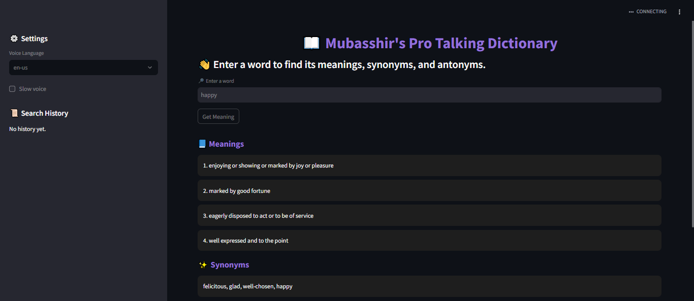

# 📖 Mubasshir's Pro Talking Dictionary (Streamlit App)



---

## 🚀 Project Overview

Welcome to **Mubasshir's Pro Talking Dictionary**, a modern interactive dictionary built with **Python** and **Streamlit**.  
This app doesn’t just show you the **meanings, synonyms, and antonyms** of a word — it also **speaks them out loud** 🗣️ using AI-powered Text-to-Speech.  

This project is part of my **AI & Full Stack Data Science (FSDS) learning journey**, where I implement practical projects and showcase them as part of my growth 🚀.  

---

## ✨ Features

✅ Search for word meanings, synonyms, and antonyms using **NLTK WordNet**  
✅ Text-to-Speech powered by **gTTS (Google Text-to-Speech)**  
✅ Auto-play audio pronunciation of meanings  
✅ Modern **Streamlit UI** with dark mode layout  
✅ Search history to quickly revisit words  
✅ Lightweight, runs anywhere with Streamlit  

---

## 🛠️ Tech Stack

- **Python 3**
- **Streamlit** → UI Framework  
- **NLTK (WordNet)** → Linguistic data (meanings, synonyms, antonyms)  
- **gTTS (Google Text-to-Speech)** → Audio generation  
- **HTML/CSS injection** → Auto-play audio & custom design  

---

## 📂 Project Structure

```bash
talking_dictionary_streamlit/
│── app.py                # Main Streamlit app
│── dictionary_utils.py   # Utility functions (WordNet + gTTS)
│── requirements.txt      # Dependencies for easy install/deploy
│── README.md             # Project description + usage
│── assets/
│    └── ss.png           # App screenshot
```

---

## ⚡ Installation & Usage

### 1️⃣ Clone the repository
```bash
git clone https://github.com/mubasshirahmed-3712/talking_dictionary_streamlit.git
cd talking_dictionary_streamlit
```

### 2️⃣ Install dependencies
```bash
pip install -r requirements.txt
```

### 3️⃣ Run the Streamlit app
```bash
streamlit run app.py
```

Your app will run at 👉 `http://localhost:8501`  

---

## 🎯 Future Enhancements
- Add **offline mode** (using pyttsx3 instead of gTTS)  
- Multi-language dictionary support 🌍  
- Deploy to **Streamlit Cloud / HuggingFace Spaces**  

---

## 📸 Preview
Here’s a sneak peek of the app in action:  


---

## 🙋‍♂️ About Me

This project is developed as part of my **AI & FSDS progress journal**.  
I am continuously building projects and sharing them with the community.  

🔗 **GitHub Journal**: [AI-FSDS Progress Journal](https://github.com/mubasshirahmed-3712/AI-FSDS-progress-journal)  
🔗 **LinkedIn**: [Mubasshir Ahmed](https://www.linkedin.com/in/mubasshir3712)  

---

💡 *Project Mentor’s Note:*  
Mubasshir has not only implemented a functional dictionary app but also customized it with a **beautiful UI, TTS integration, and branding**. This demonstrates strong skills in **Python, NLP, and Streamlit app development** 👏.  

---

✨ **Developed with dedication by Mubasshir Ahmed** ✨
